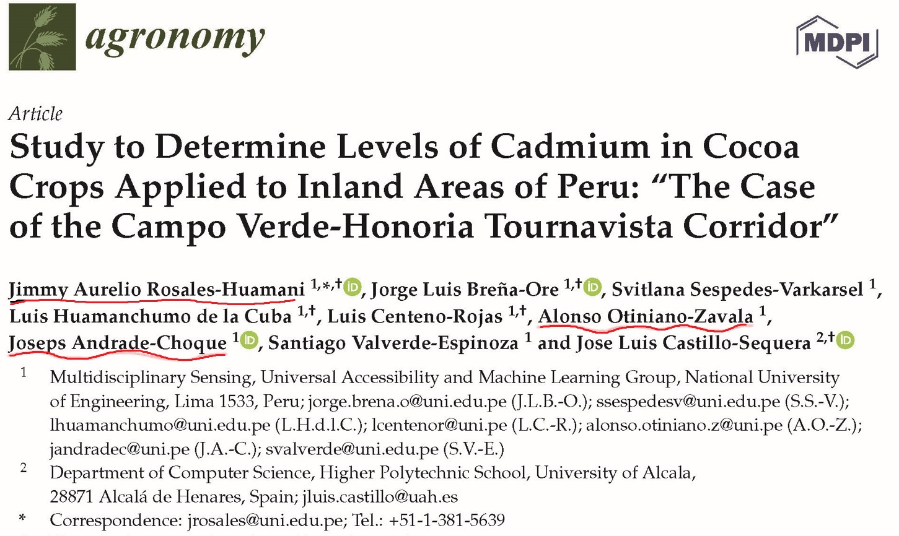
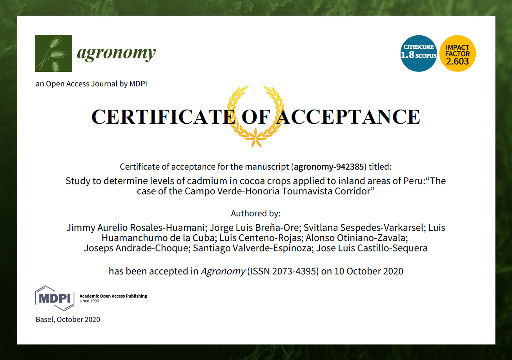

```{r setup, include=TRUE}
knitr::opts_chunk$set(echo = TRUE)
Sys.setenv('MAPBOX_TOKEN' = 'pk.eyJ1IjoiYWxvbnNvMjUiLCJhIjoiY2tveGJseXJpMGNmcDJ3cDhicmZwYmY3MiJ9.SbThU_R8YGE1Zll-nNrZKA')

library(readxl) # lectura archivos excel.
library(tidyverse);library(corrplot) # librearias de tratamiento de data
library(sf); library(raster); library(rgdal) # librerias espaciales basicas
library(mapview); library(mapedit); library(mapdeck) # librerias espaciales visualizacion especifica
library(leaflet); library(leaflet.extras)
library(htmltools)
#ms <- mapdeck_style("satellite")
mapviewOptions(basemaps = "Esri.WorldImagery")
```

```{r, echo=FALSE, eval=FALSE}
# htmltools::img(src = knitr::image_uri(file.path(R.home(""), "html", "logo.jpg")), 
#                alt = 'logo', 
#                style = 'position:absolute; top:0; right:0; padding:10px;')
```

# Publicación Internacional:

Certificado de Aceptacion:

```{r, fig.align="center", fig.cap=c("Study to Determine Levels of Cadmiumin Cocoa Crops Applied to Inland Areas of Peru"), echo=FALSE, fig.align='center'}

```

Paper:

```{r, fig.align="center", fig.cap=c("Acreditation"), echo=FALSE}

```

# Link de Descarga

El link es el siguiente: [Agronomy MDPI](https://www.mdpi.com/2073-4395/10/10/1576).

#  Video de Presentación

El link es el siguiente: [ECITEC UNI 2020](https://youtu.be/_2tM5qMYags)

# Análisis de la Información Recolectada:

## Lectura de Data

```{r}
Cacao <- read_xlsx(path = "data_IIC1/BD_Cd.xlsx", col_names = TRUE)
str(Cacao)
head(Cacao, n=5)
tail(Cacao, n=5)
summary(Cacao)

# Verificar nulos
Vacios <- sapply(Cacao, function(x) sum(is.na(x)))
Vacios

#Con mapa:
library(Amelia)
missmap(Cacao,col=c("black","grey"),legend = FALSE)

# Verificar alguna condicion y eliminar valores
# id <- which(is.na(Cacao$pHapprox)) # colocar cualquier condicion
# Cacao <- Cacao[-id, ]

id <- which(Cacao$Cdsoil_mgkg>= 1.4 & Cacao$Cdsoil_mgkg <= mean(Cacao$Cdsoil_mgkg, na.rm=TRUE))
Cacaonew <- Cacao[id, ] 
Cacaonew %>% dplyr::select(Pbsoil_mgkg) %>% summarise(media_Pb = mean(Pbsoil_mgkg))
```

# Exploracion Basica

## Univariante

```{r}
par(mfrow=c(2,2))
hist(Cacao$Cdsoil_mgkg)
boxplot(Cacao$Cdsoil_mgkg)
plot(density(Cacao$Cdsoil_mgkg))
plot(log(Cacao$Cdsoil_mgkg))
```

## Revisión del Modelo de Elevación Digital:

```{r, fig.align='center'}
DEM <- raster("data_IIC1/DEM_DRONE/Zona_Oeste.tif")
str(DEM)
# DEM
# slope <- terrain(DEM, opt ="slope")
# aspect <- terrain(DEM, opt="aspect")
# DEM.hill <- hillShade(slope, aspect, angle = 40, direction = 270)
# esta es importante pero demora       DEM <- crop(DEM, extent(518600, 519200, 9031800, 9032400))
#plot(DEM, main = "Drone - Digital Elevation Model (DEM)", col = topo.colors(20),
#     zlim=c(0, 250))
image(DEM, main = "Drone - Digital Elevation Model (DEM)", col = topo.colors(20),
      zlim=c(0, 250))
```

## Revisión del DEM con factores:

```{r, warning=FALSE, message=FALSE}
Factores_cacao <- st_read(dsn = "data_IIC1/Cacao_Factors/Age_Planta.shp")
str(Factores_cacao)
summary(Factores_cacao)
Factores_cacao <- Factores_cacao %>% mutate_if(is.character, as.factor)
summary(Factores_cacao)
mapview(Factores_cacao)
```

```{r}
mapview(DEM, legend =TRUE)+
  mapview(Factores_cacao, alpha.regions = 0.01 , legend.opacity = 0.10, 
         lwd = 2, color = "blue")
```

## Generando Shapefiles (Opcional):

```{r, fig.align='center', warning=FALSE, message=FALSE}
Factores_cacao2 <- as.data.frame(Factores_cacao)
#Factores_cacao2$Uso_Tierra <- edit(Factores_cacao2$Uso_Tierra)

Factores_cacao2$Var_cocoa <- c("Creole-Aromatic","CCN51","","CCN51","Creole-Aromatic",
                               "CCN51")
Factores_cacao3 <- st_as_sf(Factores_cacao2)

mapview(Factores_cacao3, zcol="Var_cocoa")
```


```{r, warning=FALSE, message=FALSE}
Honoria_elementos <- readxl::read_xlsx(path = "data_IIC1/BD_Cd.xlsx")
str(Honoria_elementos)
Honoria_elementos <- Honoria_elementos %>% rename(Este= Xeast, Norte=Ynorth, 
                                                  Cd = Cdsoil_mgkg,
                                                  Pb = Pbsoil_mgkg,
                                                  Zn = Znsoil_mgkg,
                                                  pH = pHapprox,
                                                  Ce = Ceapprox_uS_cm)
Honoria_elementos2 <- Honoria_elementos[ ,c("Norte","Este")]
Honoria_elementos2 <- Honoria_elementos2[ ,order(c(names(Honoria_elementos2)))]
sputm  <- SpatialPoints(Honoria_elementos2, proj4string=CRS("+proj=utm +zone=18 +south +datum=WGS84")) 
spgeo  <- spTransform(sputm, CRS("+proj=longlat +datum=WGS84"))
spgeo  <- as.data.frame(spgeo)
colnames(spgeo) <- c("lng","lat")
Honoria_elementos2 <- cbind(Honoria_elementos,spgeo)

Honoria_elementos3 <- st_as_sf(Honoria_elementos2, coords = c("lng", "lat"),
                               remove = FALSE, crs = 4326, agr = "constant")

mapview(Honoria_elementos3, zcol = "Cd") +mapview(Factores_cacao3, zcol="Var_cocoa")+
  mapview(Factores_cacao3, zcol = "Uso_Tierra")+
  mapview(Factores_cacao3, zcol = "Age")

Factores_cacao4 <- Factores_cacao3 %>%  st_transform(crs = 4326 )
  
H <- Honoria_elementos3 %>%  st_intersection(Factores_cacao4)

mapview(H, zcol = "Uso_Tierra", cex = "Cd")+
  mapview(Factores_cacao, alpha.regions = 0.01 , legend.opacity = 0.10, 
          lwd = 2, color = "blue")

mapview(H, zcol = "Age", cex = "Cd") +
  mapview(Factores_cacao, alpha.regions = 0.01 , legend.opacity = 0.10, lwd = 2, color = "blue")

mapview(H, zcol = "Var_cocoa", cex = "Cd") +
  mapview(Factores_cacao, alpha.regions = 0.01 , legend.opacity = 0.10, lwd = 2, color = "blue")
```

### Estandar de Calidad de Cd en Suelos:

Valor límite del Cd en suelos es: $$Cd<=1.4$$

```{r, fig.align='center', warning=FALSE, message=FALSE}
mapview(Honoria_elementos3, zcol = "Cd", at = c(0,1.4,2.5), legend = TRUE,
         col.regions = c("green", "red"))+
  mapview(Factores_cacao, alpha.regions = 0.01 , legend.opacity = 0.10, 
          lwd = 2, color = "blue")
```

# Data Table:

```{r, fig.align='center', warning=FALSE, message=FALSE}
Factores_cacao_n <- Factores_cacao 
Honoria_elementos_n <- Honoria_elementos3 %>% st_transform(crs = st_crs(Factores_cacao))
# sf_use_s2(TRUE) #cambiar a spherical geometry
intersection <- st_intersection(Honoria_elementos_n, Factores_cacao_n)
intersection
```

```{r, fig.align='center', warning=FALSE, message=FALSE}
Honoria_statical <- intersection %>% st_set_geometry(NULL)
```

# Statical Summary:

```{r, fig.align='center', warning=FALSE, message=FALSE}
min_max_mean_sd <- list(
  min = ~min(.x, na.rm = TRUE),
  max = ~max(.x, na.rm = TRUE),
  mean = ~mean(.x, na.rm = TRUE),
  sd = ~sd(.x, na.rm = TRUE)
)
```

```{r, fig.align='center', warning=FALSE, message=FALSE}
Honoria_statical %>% 
  summarise(across(c(Cd, Pb, Zn, pH, Ce), min_max_mean_sd))
```

```{r, fig.align='center', warning=FALSE, message=FALSE}
Honoria_statical %>% group_by(Age) %>% 
  summarise(across(c(Cd, Pb, Zn, pH, Ce), min_max_mean_sd))
```

Ver `vignette("colwise")` para más detalles.

# Boxplot Analysis:

## Cd total:

```{r, fig.align='center', warning=FALSE, message=FALSE}
ggplot(data = Honoria_statical)+
  geom_boxplot(mapping = aes(x = Cd))+
  coord_flip()
```

## Cd by Factor Age and Land Use:

```{r, fig.align='center', warning=FALSE, message=FALSE}
ggplot(data = Honoria_statical)+
  geom_boxplot(mapping = aes(x = Cd))+
  facet_grid(. ~ Age)+
  coord_flip()
```

```{r, fig.align='center', warning=FALSE, message=FALSE}
ggplot(data = Honoria_statical)+
  geom_boxplot(mapping = aes(x = Cd))+
  facet_grid(. ~ Uso_Tierra)+
  coord_flip()
```

## Cd by Prior Exploration Field:

```{r, fig.align='center', warning=FALSE, message=FALSE}
ggplot(data = Honoria_statical)+
  geom_boxplot(mapping = aes(x = Cd))+
  facet_grid(. ~ Uso_Tierra)+
  coord_flip()
```

# Average Cadmiunm Soil

# Corrplot Bivariant

```{r, fig.align='center', warning=FALSE, message=FALSE}
correlacion <- cor(Honoria_statical[ ,c("Cd", "Pb", "Zn", "pH", "Ce")]
                   , method = "pearson")
corrplot(correlacion, method ="circle", diag = TRUE, title= "Correlacion de Pearson Honoria", 
         hclust.method = "median", addrect = 2)
corrplot(correlacion, method ="circle", diag = TRUE, title= "Correlacion de Pearson Honoria")
         
```

```{r, fig.align='center', warning=FALSE, message=FALSE}
correlacion2 <- cor(Honoria_statical[ Honoria_statical$Uso_Tierra=="Maiz 10", c("Cd", "Pb", "Zn", "pH", "Ce")], method = "pearson")
# correlacion2 <- cor(Honoria_statical %>% filter(Uso_Tierra=="Maiz 10") %>%
#                     select(Cd, Pb, Zn, pH, Ce), method = "pearson")
corrplot(correlacion2, method ="number")
corrplot(correlacion2, method ="circle", order = "AOE")
corrplot(correlacion2, method = 'shade', order = 'AOE', diag = FALSE) 
corrplot(correlacion2, method = 'square', order = 'AOE', diag = FALSE, type = "lower")
```

```{r, fig.align='center', warning=FALSE, message=FALSE}
correlacion3 <- cor(Honoria_statical[Honoria_statical$Uso_Tierra=="Pasto 10", c("Cd", "Pb", "Zn", "pH", "Ce")], method = "pearson")
corrplot(correlacion3, method ="circle")
corrplot.mixed(correlacion3, order = 'AOE')
```

Para ver toda la funcionalidad revisar : [An Introduction to corrplot Package](https://cran.r-project.org/web/packages/corrplot/vignettes/corrplot-intro.html).


# Opcional

## Biplot Multivariant (Principal Component Analysis)

## Cadmium Final Geostatistics Map:

```{r, fig.align='center', warning=FALSE, message=FALSE}
library(gstat)
```

```{r, fig.align='center', warning=FALSE, message=FALSE}
class(Honoria_elementos3)
summary(Honoria_elementos3)
```

## Bubbgle Map:

```{r, fig.align='center', warning=FALSE, message=FALSE}
Honoria_elementos4 <- Honoria_elementos3 %>% st_set_geometry(NULL)
coordinates(Honoria_elementos4) <- ~Este+Norte
class(Honoria_elementos4)
summary(Honoria_elementos4)
```

```{r, fig.align='center', warning=FALSE, message=FALSE}
bubble(Honoria_elementos4, "Cd", col = c("green","green"), main = "Cadmium Concentrations (ppm)")
```

Grilla generada por Meuse Data:

```{r, fig.align='center', warning=FALSE, message=FALSE}
data(meuse.grid)
ggplot(data = meuse.grid) + geom_point(aes(x, y))
```

```{r, fig.align='center', warning=FALSE, message=FALSE}
# Hacemos una grilla regular con `SpatialPolygonsDataFrame`
proj4string(Honoria_elementos4) <- CRS("+proj=utm +zone=18 +south +datum=WGS84") #definimos proyección
```

```{r, eval=FALSE, fig.align='center', warning=FALSE, message=FALSE}
Honoria_elementos4  <- spTransform(Honoria_elementos4, CRS("+proj=longlat +datum=WGS84"))

grd <- makegrid(Honoria_elementos4, n = 1000) #generamos grilla
colnames(grd) <- c("x", "y") #asignamos nombres
plot(grd$x,grd$y) #visualizamos


# Next, convert the grid to `SpatialPoints` and subset these points by the polygon.
grd_pts <- SpatialPoints(
  coords      = grd, 
  proj4string = CRS(proj4string(Honoria_elementos4))
)


# Then, visualize your clipped grid which can be used for kriging
ggplot(as.data.frame(coordinates(grd_pts))) +
  geom_point(aes(x, y))

gridded(grd_pts) <- TRUE
grd_pts <- as(grd_pts, "SpatialPixels")

```


```{r, fig.align='center', warning=FALSE, message=FALSE}
Limite2 <- readOGR(dsn="data_IIC1/Cacao_shp//Limite_Cacao..shp")

grd <- makegrid(Limite2, n = 1000) #generamos grilla
colnames(grd) <- c("x", "y") #asignamos nombres
plot(grd$x,grd$y) #visualizamos


# Next, convert the grid to `SpatialPoints` and subset these points by the polygon.
grd_pts <- SpatialPoints(
  coords      = grd, 
  proj4string = CRS(proj4string(Limite2))
)

# subset all points in `grd_pts` that fall within `spdf`
grd_pts_in <- grd_pts[Limite2, ]

grd_pts_in2 <- grd_pts_in
proj4string(grd_pts_in2) <- CRS("+proj=utm +zone=18 +south +datum=WGS84")
gridded(grd_pts_in2) <- TRUE
grd_pts_in2 <- as(grd_pts_in2, "SpatialPixels")

```

```{r, fig.align='center', warning=FALSE, message=FALSE}
cd.idw = idw(Cd~1, Honoria_elementos4, grd_pts_in)
spplot(cd.idw["var1.pred"], main = " Cadmium inverse distance weighted interpolations")
```

```{r, fig.align='center', warning=FALSE, message=FALSE}
cd.idw = idw(Cd~1, Honoria_elementos4, grd_pts_in2)
spplot(cd.idw["var1.pred"], main = " Cadmium inverse distance weighted interpolations")
```

```{r, fig.align='center', warning=FALSE, message=FALSE}
m <- vgm(.59, "Sph", 874, .04) #setear bien
x <- krige(log(Cd)~1, Honoria_elementos4, grd_pts_in2, model = m)
spplot(x["var1.pred"], main = "ordinary kriging predictions")
spplot(x["var1.var"],  main = "ordinary kriging variance")
```


