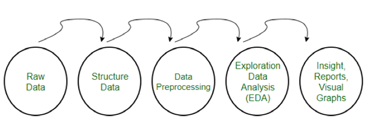
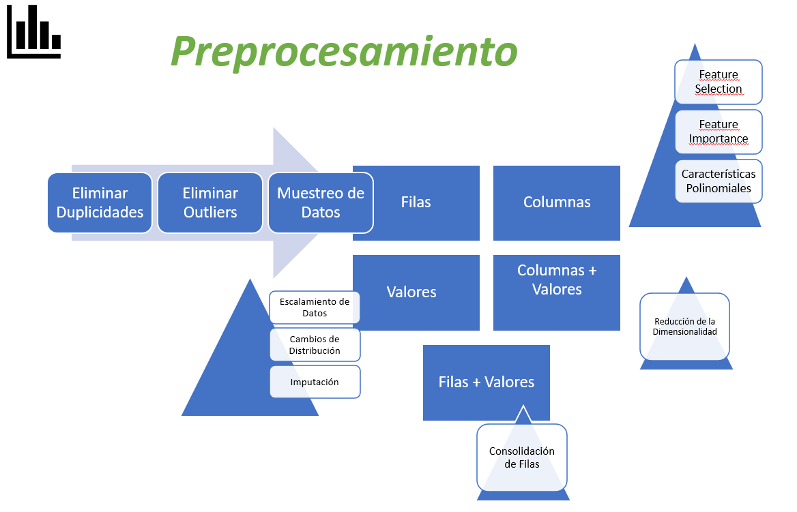
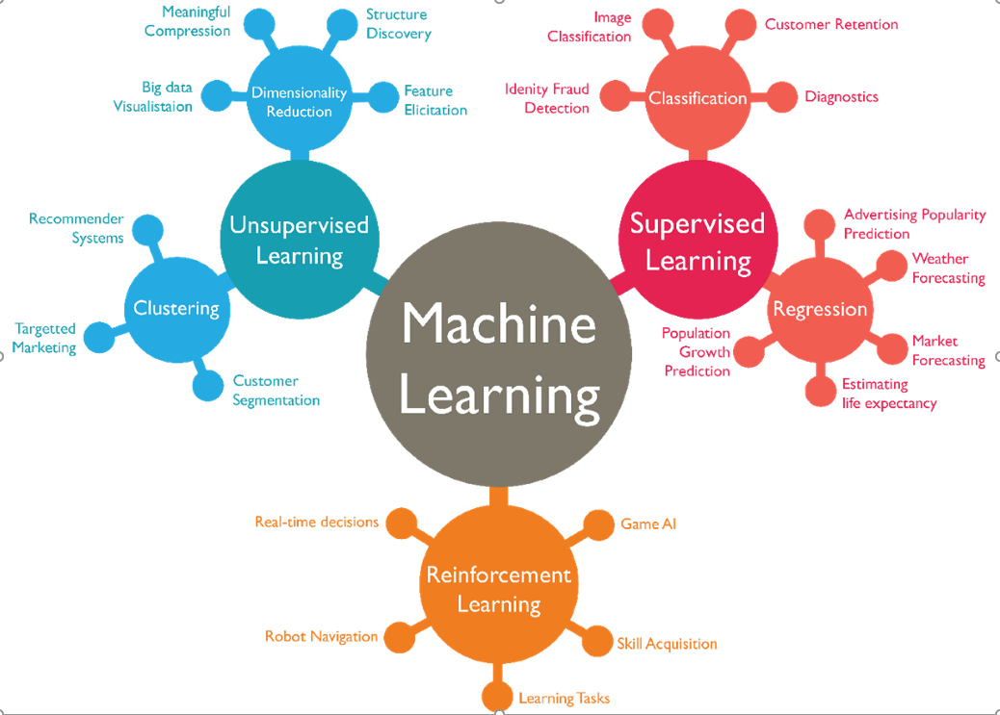
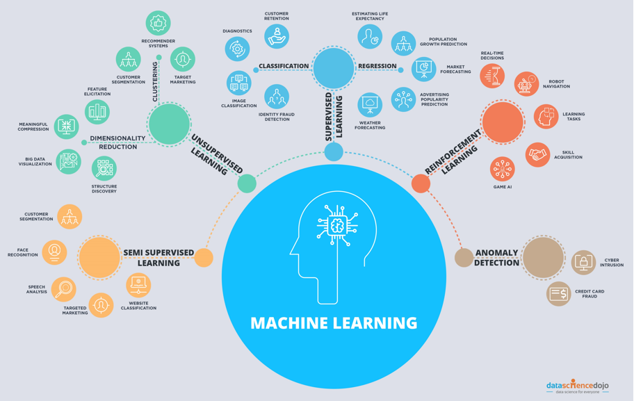
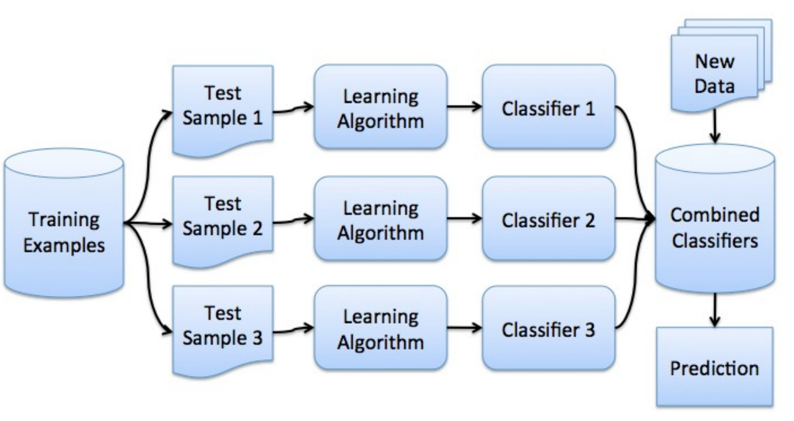
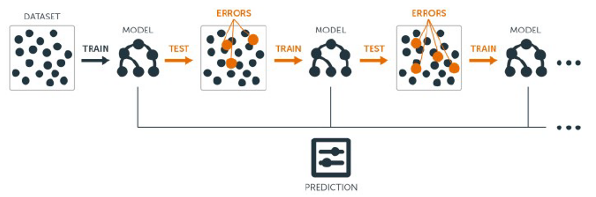
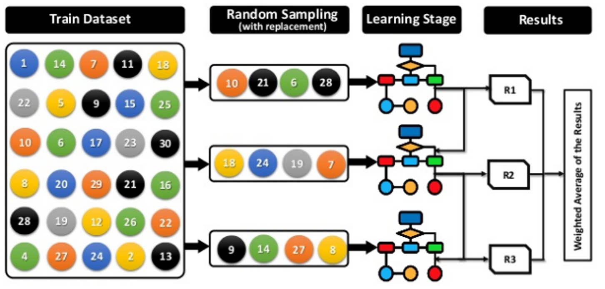
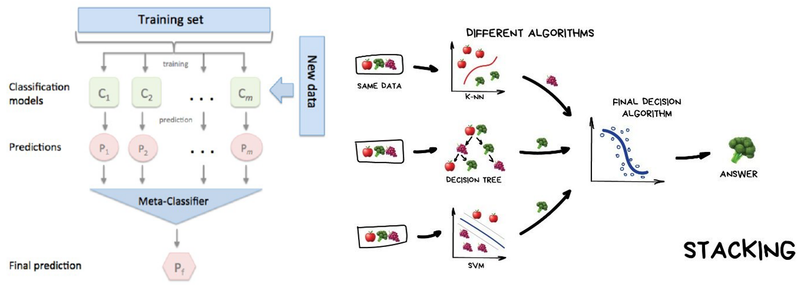

```{r setup, include=FALSE}
knitr::opts_chunk$set(echo = FALSE)
```

---

# Definiciones

* Machine Learning trata sobre la construcción de algoritmos que pueden aprender y hacer predicciones con datos; básicamente datos que aprendan con la experiencia.

--

* Arthur Samuel (1954) Machine Learning : “Área de estudio que les da a las computadoras la habilidad de aprender sin ser explícitamente programadas”.

--

* Según Tom M. Mitchel (1998): “ a un programa de computadora se le indica aprender de la experiencia E con respecto a una tarea T y alguna medida de desempeño P, si su rendimiento sobre T, medido por P, mejora con la experiencia de E.

--

* La estadística tradicional tiene la funcionalidad de llegar a comprender los datos.

--

* Modelado predictivo tiene por objetivo descubrir patrones de comportamiento de nuestros datos.

--

[hop back to the end](#hop) 

---

# Pasos Generales

.pull-left[
* Análisis de datos:
  * Carga de un conjunto de Datos
  * Estadísticas Descriptivas
  * Visualización de Datos

* Tratamiento de datos
  * Preprocesamiento de datos
  * Métodos de Remuestreo
  * Evaluación de las métricas

* Fase Modelado
  * Feature Selection
  * Algoritmos de Machine Learning
  * Rendimiento de algoritmos
]

--

.pull-right[

* Fase Optimización y Forecasting

  * Configuración de Hiperparámetros
  * Algoritmos en conjunto
  * Guarda y realiza predicciones
  * Plantilla de modelado predictivo

* Proceso de Aprendizaje del ML:
  * Definición del problema
  * Preparaciónde los datos
  * Evaluación de un conjutno de algoritmos (diversa taxonomía)
  * Mejoras de los resultados en la fase de optimización (tunning).
]

--

.footnote[**Finalizar el modelo y presentar los  resultados**]

---

# Análisis de Datos

>- El análisis de datos se realizó a través de todo el curso con las funciones básicas de la estructura de la data, los tipos de data estructurada, semiestructurada y no estructurada.


--

>- Se vio la manipulación de datos de manera detallada, la estadística descriptiva (sumario de datos, medidas de tendencia central, de dispersión, correlaciones, entre otros), visualización (univariante – histograma, densidad, boxplots, barplots, datos nulos, etc. Multivariante – correlación, matriz de dispersión, matriz de dispersión por clases, matriz de densidad por clase, boxplot por clase, entre otros)


---

# Tratamiento de Datos

El tema tratamiento de datos fue visto anteriormente y desarrollado a detalle siguiendo este proceso: 

*Preprocesamiento* -> **Métodos de Remuestreo** -> *Evaluación de las Métricas*


.pull-left[
Se tomó en consideracion inicial

]


.pull-right[
Para el preprocesamiento:

]


---

# Tratamiento de Datos II

* Se explico que es el Aprendizaje Supervisado con problemas de Clasificación y Regresión y el Aprendizaje No Supervisado.


--

* La necesidad del tratamiento de datos y todo lo que implica el proceso de Machine Learning y porque el procesamiento ayuda a generar precisiones robustas a la hora de realizar los modelos de Machine Learning, además de las consideraciones para realizarlo, la transformaciones autónomas y entrenamiento de caret y los métodos BoxCox, YeoJohnson, expoTrans, zv, nzv, center, scale, range, pca, ica, spatialSign entre otros.


--

* Finalmente se recomendó que debemos usarla y en variedad, además de revisar que pasa con los datos gráfica y numéricamente antes y después de la transformación.

---

# Fase de Modelado – Feature Selection

Esta parte será tratada a detalle primero veremos lo que corresponde a feature selection aunque no es parte de los modelos es importante la selección de características que son importantes dentro de la data para el modelo, siguiendo el principio los modelos más simples son los mejores, el feature selection nos permiten selección las mejores características, es decir los atributos más relevantes para el modelo.

Existen 4 razones fundamentales para usar el feature selection:

--

* *Simplificación* de los modelos

--

* *Menor tiempo* de entrenamiento

--

* Evitar maldición de la dimensionalidad (*course of dimensionality*) ¿Cuánto más datos mejor?

--

* Generalización realzada por reducir el *“overfitting”* (reducción de la varianza). “Overfitting” es el efecto de sobreentrenar un algoritmo de aprendijaze con unos ciertos datos para los que se conoce el resultado deseado.

---

.pull-left[
```{r, out.width='120%', fig.align='left', fig.cap='Overfitting' }
knitr::include_graphics(path="Figuras/OV01.png")
```

```{r, out.width='120%', fig.align='left'}
knitr::include_graphics(path="Figuras/OV02.png")
```

]

.pull-right[
Vemos en la imagen izquierda las caracteristas de *underfitted*, **good Fit/Robust** y *Overfitted* que representan las formas del funcionamiento del modelo, lo que deseamos siempre es el *good Fit/Robust* que es el mejor!
]

El `Feature Selection` tiene un **Algoritmo de Búsqueda** (Search Technique) y una **Función de Evaluación** (Criterion Function).

```{r, out.width='60%', fig.align='left', fig.align='center'}
knitr::include_graphics(path="Figuras/OV03.png")
```

---

# Técnicas del Feature Selection-Importance:


* **Coeficiente de Correlación:** La idea es que aquellas características que tiene una alta correlación con la variable dependiente son predictores fuertes cuando se usan en un modelo. Funciona muy bien como una lista inicial para regresiones lineales y una idea para regresiones no lineales.

--

* **Eliminación de características redundantes:** Eliminar atributos altamente correlacionados es útil (>0.75, en general).

--

* **Basadas en modelo de regresión:** A través de la varianza se mara que características son importantes las que marcan mayor que 0.05 en el p-valor nos dan idea de importancia con confiabilidad mayor a 95%.

--

* **Basadas en conocimiento:** La importancia de los datos se puede estimar a partir de datos mediante la construcción de un modelo. Algunos métodos como los árboles de decisión tienen un mecanismo incorporado para informar sobre la importancia de la variable. Para otros algoritmos, la importancia se puede estimar utilizando un análisis de curva ROC realizado para cada atributo.


---

# Técnicas del Feature Selection-Importance:


* **Basadas en aprendizaje con Random Forest:** El algoritmo Random Forest se basa en árboles de decisión y utilizan el empaquetamiento para crear un modelo sobre los datos. RF también tiene una metodología de feature selection  que utiliza el “Índice de Gini” para asignar una puntuación y clasificar las características. Considerar que la disminución media en el índice de Gini es más alta para la característica más importante.

--

* **Eliminación de características recursivas:** Los métodos feature selection automáticos se pueden usar para crear muchos modelos con difertenes subconjuntos de datos e identificar aquellos atributos que son y no se requieren para construir un modelo preciso uno de ellos es la eliminación recursiva de atributos usando RF.


---

# MODELADO  MACHINE LEARNING

* Para realizar los modelos Machine Learning la única salida es la <span style="color:red"><font size="5">base de prueba y error</font></span> para poder elegir el mejor algoritmo para un problema. Aunque existe una guía para saber cual aplicar el test realizado nos llevara a lograr el objetivo. Debemos modelar datos con algoritmos de taxonomía lineal y no lineal, el truco es la **Experiencia en Machine Learning**, **Entender que es un Problema Empírico**.

* Modelo más preciso para el conjunto de datos (imágenes, voz, datos simples, etc.). 

* Aprendizaje Supervisado (Problemas de Regresión y Clasificación) y Aprendizaje No Supervisado (Clustering).


---

# Machine Learning Models





---

# Machine Learning Models




---

# Algoritmos de Machine Learning

```{r}
knitr::include_graphics(path="Figuras/ML03.png")
```

---

background-image: url("https://i.scdn.co/image/c9646908e893fd4ebbcc08c2ec46a3c26f039c90")
background-size: cover
class: right, top, inverse

# GG!


---

# ¿Cuáles Algoritmos Revisar?

* Probar una mezcla de representaciones de algoritmos (e.g, métodos basados en instancias y árboles).

* Prueba una mezcla de algoritmos de aprendizaje (e.g., algoritmos para aprender el mismo tipo de representación).

* Prueba una mezcla de tipos de modelos (e.g., funciones lineales y no lineales o paramétricas y no paramétricas).


---

## Modelos Basados en instancias y árboles:

Los **modelos basados en instancias** se almacenan los ejemplos de entrenamiento y cuando se quiere clasificar un nuevo objeto, se extraen los objetos más parecidos y se usa su clasificación para clasificar al nuevo objeto. Este tipo de aprendizaje se conoce como **“lazy learning” o “memory-based-learning”** donde los datos de entrenamientos se procesan solo hasta que se requiere (cuando se quiere contestar una pregunta), y la relevancia de los datos se mide en función de una medida de distancia, es decir, algoritmos que crean un modelo a partir de una base de datos y ase agregan nuevos datos comparando sus similitud con las muestras ya existentes para encontrar la mejor pareja y hacer la predicción.

Los **modelos basados en árboles** modelan la toma de decisión basado en valores actuales (reales) de los atributos que tienen nuestros datos. Se utilizan para clasificación de información, bifurcando y modelando los posibles caminos tomados y su probabilidad de ocurrencia para mejorar su precisión. Una vez armados, los árboles de decisión ejecutan muy rápido para obtener resultados.


---

class: inverse, middle, center

## Modelos Basados en instancias y árboles II:

```{r, fig.align='center', out.width="100%"}
knitr::include_graphics(path="Figuras/ML04.png")
```

---

# Métodos paramétricos Vs. No paramétricos:

* Los modelos paramétricos parten de una función de distribución o clasificación conocida, y reducen el problema a estimarlos parámetros que mejor ajusten la observación de la muestra. Dichos modelos resultan muy potentes cuando se cumples los supuestos o hipótesis de partida, pero muy sensibles sino se cumple. Linear Regression, Linear Discriminant Analysis y Logistic Regression.

* Los modelos no paramétricos, métodos de distribución libre como Árboles de decisión (CART) y Multilayer Percepton.

---

background-image: url("https://ars.els-cdn.com/content/image/1-s2.0-S0098135413002639-gr1.jpg")
background-size: contain
class: right, top, inverse

# No te olvides del Semiparamétrico

---
class: inverse, middle, center

# Algoritmos Lineales

---

# REGRESION LINEAL MULTIPLE

Es uno de modelos más conocidos aunque requerie una cantidad de supuestos importantes como :

**Distribución Normal**, **Homocedasticidad de errores**, **varianza cuasiconstante** entre otros, es uno de los más aplicados por facilidad de uso, sin embargo debemos tener mucho cuidado al aplicarlo!

```{r, fig.align='center', out.width="100%", out.height="100%"}
knitr::include_graphics(path="Figuras/AL01.png")
```


---

# Un codigo R de Regresion Lineal

```{r, echo=TRUE}
fit = lm(dist ~ 1 + speed, data = cars) # una regresion aburrida
summary(fit)
```

---

# REGRESION LOGISTICA

* Para problemas de <span style="color:red">clasificación binaria</span>.

* Este modelo ayuda a determinar si la entrada pertenece a un sector especifico.

* Utiliza la función sigmoide que tiene un rango de valores de salida entre 0 y 1.


```{r, fig.align='center', out.width="100%", out.height="100%"}
knitr::include_graphics(path="Figuras/AL02.png")
```

---

# LINEAR DISCRIMINANT ANALYSIS

* Problemas de Clasificación. Se usa frecuentemente como una técnica de reducción de dimensionalidad para el reconocimiento o clasificación de patrones y machine learning.

```{r, fig.align='center', out.width="100%", out.height="100%"}
knitr::include_graphics(path="Figuras/AL03.png")
```

---

# REGULARIZED REGRESSION

* El algoritmo es extremadamente rápido y puede explotar la dispersión en la matriz de entrada ‘x’. Utilizado para clasificación y regresión.

Ver https://grivz.shinyapps.io/PKLM/_w_fe58afc4/#Lasso.

```{r, fig.align='center', out.width="80%", out.height="80%"}
knitr::include_graphics(path="Figuras/AL04.png")
```

---

class: inverse, middle, center

# Algoritmos No Lineales

---

# K – NEAREST NEIGHBORS

* Clasifica la entrada basándose en una medida de similitud, que a menudo es la distancia en el espacio de los puntos de datos.

* Se hace una predicción eligiendo la clase mas frecuente entre los k vecinos mas cercanos.

```{r, fig.align='center', out.width="100%", out.height="100%"}
knitr::include_graphics(path="Figuras/ANL01.png")
```

---

# Naive Bayes

* Realiza la clasificación asumiendo la independencia entre las características (ingenuo) y calcula las clases según la probabilidad bayesiana.

* Naive Bayes es un algoritmo de clasificación binario y multiclase útil para grandes conjuntos de datos.

```{r, fig.align='center', out.width="120%", out.height="100%"}
knitr::include_graphics(path="Figuras/ANL02.png")
```

---

# SUPPORT VECTOR MACHINE

Dados los datos en el espacio, SVM construye hiperplanos en un espacio de alta dimensión con una brecha máxima entre ellos. Con la ayuda de las funciones del kernel, puede realizar la clasificación de datos de alta dimensión.

```{r, fig.align='center', out.width="100%", out.height="100%"}
knitr::include_graphics(path="Figuras/ANL03.png")
```

---

# Classification and Regression Trees (CART)

>- Son modelos predictivos que coloca las observaciones realizadas a partir de los datos en las ramas; estos conducen a las hojas que están etiquetadas con la clasificación correcta.

>- Utiliza un conjunto discreto de valores, y las hojas producen el resultado final.

>- Tienen mejor comportamiento con atributos discretos (dummy, categóricos) → Es recomendable convertir si están los atributos en numéricos

---

class: inverse, middle, center

# CART

```{r, fig.align='center', out.width="100%", out.height="100%"}
knitr::include_graphics(path="Figuras/ANL04.png")
```

---

class: inverse, middle, center

# FORECASTING

---

# FORECASTING

Mejorar la métrica de los algoritmos mediante la configuración de sus hiperparametros.

* Es importante en esta fase tener 3 o 4 algoritmos candidatos.

`FAQs:`

– **¿Que hiperparametros afinar?**

* Cada algoritmo tiene sus propios hiperparametros.

– **¿Que método de búsqueda utilizar para localizar buenos parámetros de algoritmo?**

* Tenemos dos técnicas principales, grid search y random search.

– **¿Que opciones de prueba usar para limitar el ajuste excesivo de los datos de entrenamiento?**

* Tenemos que cuidarnos en no caer en overfitting.


---
class: inverse, middle, center

# ALGORITMOS DE CONJUNTO


---

# Algoritmo de Conjunto

Son denominado algoritmos de **ensamblado** y son muy usados cuando se desarrollan modelos de machine learning avanzados.



---

# Bagging

Construye múltiples modelos (típicamente modelos del mismo
tipo) a partir de diferentes submuestras del conjunto de datos de entrenamiento.

Algoritmos:

* Bagged Decision Trees
* Random Forest (RF)
* Extras Trees

```{r, fig.align='center', out.width="55%", out.height="70%"}
knitr::include_graphics(path="Figuras/AC02.png")
```

---

# Boosting

Construye múltiples modelos (típicamente modelos del mismo 
tipo), cada uno de los cuales aprende a corregir los errores de 
predicción de un modelo anterior en la cadena.

* AdaBoost
* Stochastic Gradient Boosting



---

# Voting

 Construye múltiples modelos (típicamente modelos de diferentes tipos) y un modelo supervisado que aprende cómo combinar mejor las predicciones de los modelos primarios.



---

# Stacking

Construye múltiples modelos (típicamente modelos de diferentes tipos) y un modelo supervisado que aprende como combinar mejor las predicciones de los modelos primarios.



---

class: inverse, middle, center

# Evaluación Gráfica de Modelos

```{r, fig.align='center', out.width="65%"}
knitr::include_graphics(path="Figuras/Ev01.png")
```

---
class: inverse, middle, center

# APRENDIZAJE NO SUPERVISADO


---

# APRENDIZAJE NO SUPERVISADO

El clustering (**agrupamiento**) consiste en dividir un conjunto de elementos heterogéneos en clústers o grupos homogéneos.

--

Se considera un paradigma de clasificación no supervisada, ya que asigna una clase a cada elemento (clúster al que pertenece), pero dichas clases no son conocidas durante el proceso de aprendizaje de el modelo.

.pull-left[
* **Alta similaridad intra-cluster** (entre los elementos de un mismo clúster).

* **Baja similaridad inter-cluster** (entre los elementos de distinto clústers).

]

.pull-right[
```{r, fig.align='center', out.width="100%"}
knitr::include_graphics(path="https://juandomingofarnos.files.wordpress.com/2018/05/32944225_10217024194623464_535350480692314112_n.jpg?w=802&h=345")
```
]

---

# ANS

```{r, fig.align='center', out.width="100%"}
knitr::include_graphics(path="Figuras/ANS01.PNG")
```

---
# Algoritmos de ANS

* **Basados en centroides:** Construyen distintas particiones y las evalúan en función de algún criterio (generalmente basados en distancia). Ejemplos de algoritmos son: k-means, k-medoids, etc.

--

* **Jerárquicos:** Crean una descomposición jerárquica del conjunto de datos (objetos) usando algún criterio. Ejemplos de algoritmos son: Diana, Agnes, BIRCH, ROCK, etc.

--

* **Métodos basados en densidad:** Se basan en conectividad y en funciones de densidad de puntos en el espacio. Ejemplos de algoritmos son: DBSCAN, OPTICS, DenClue, etc.

--

* **Basados en modelos:** Se propone un modelo hipótesis para cada uno de los clústers y se trata de encontrar el mejor ajuste de ese modelo a otros. EM, COBWEB, etc.


---

# ANS

```{r, fig.align='center', out.width="100%"}
knitr::include_graphics(path="Figuras/ANS02.PNG")
```

---

class: inverse, middle, center

# Tener Cuidado al Avanzar

---

background-image: url('https://slides.yihui.org/gif/saw-branch.gif')
background-size: cover
class: left, top, inverse

# Yo puedo solo!!!

---

background-image: url("https://media1.tenor.com/images/28ee6748d1e75ed138a58dfda27a0469/tenor.gif?itemid=4855087")
background-position: center
background-size: contain
class: inverse

# Un Gráfico, Tabla y Mapa Interactivo en ppt !

---

```{r, echo=FALSE, warning=FALSE, message=FALSE}
library(ggplot2)
library(plotly)
p <- ggplot(gapminder::gapminder, aes(gdpPercap, lifeExp, color = continent)) +
  geom_point(alpha = 0.5) + geom_smooth() + scale_x_log10() + theme_bw()
ggplotly(p)
```

---

```{r}
DT::datatable(
  head(gapminder::gapminder, 10),
  filter = "top",
  fillContainer = FALSE, options = list(pageLength = 8)
)
```

---

```{r}
library(leaflet)
content <- paste(sep = "<br/>",
  "<b><a href='http://www.figmm.uni.edu.pe'>La Uni es lo Máximo</a></b>",
  "FIGMM",
  "Lima, Peru"
)
leaflet() %>% addTiles() %>% 
  addPopups(lat = -12.020146, lng= -77.047993, content,
    options = popupOptions(closeButton = FALSE)
  )

```

---

class: inverse, middle, center

# Super Learning

Hay que leer jóvenes [aquí](https://towardsdatascience.com/super-learner-versus-deep-neural-network-aa78547aabd7).

---
class: center

# Avanzando en R y Geociencias (印)

Siempre Adelante


---

class: center, middle

# Gracias Totales!

Slides son creados via el R package [**xaringan**](https://github.com/yihui/xaringan).

El chacra proviene de [remark.js](https://remarkjs.com), [**knitr**](https://yihui.org/knitr/), y [R Markdown](https://rmarkdown.rstudio.com).


